# 📰 AI News Analyzer

여러 소스에서 뉴스를 수집하고, SQLite에서 데이터를 정제 및 중복 제거한 뒤, Google Gemini를 사용하여 AI 요약과 트렌드 인사이트 분석을 수행하고, 차트와 리포트를 생성하며, 데이터를 다양한 형식으로 내보내는 CLI 기반 자동화 데이터 파이프라인이다.

---

## 📌 목차
- [📖 프로젝트 개요](#-프로젝트-개요)
- [✨ 주요 기능](#-주요-기능)
- [🛠️ 기술 스택](#️-기술-스택)
- [📁 디렉터리 구조](#-디렉터리-구조)
- [⚙️ 설치](#️-설치)
- [🔑 API 키 설정](#-api-키-설정)
- [🚀 사용법](#-사용법)
- [📊 출력 파일 확인](#-출력-파일-확인)
- [🔄 프로그램 흐름도](#-프로그램-흐름도)
- [⏱️ 자동 스케줄링 (Cron / Task Scheduler)](#️-자동-스케줄링-cron--task-scheduler)

---

## 📖 프로젝트 개요

**AI News Analyzer**는 Python으로 구현한 end-to-end 데이터 파이프라인을 보여준다:
1. **Fetch**: RSS 피드, NewsAPI 또는 웹 크롤링을 통해 원시 뉴스 기사를 수집.
2. **Clean**: 텍스트와 날짜를 정규화하고, 누락된 값을 처리하며, 전체 기사 본문을 추출하고, 중복 제거 정책(`skip` / `upsert`)을 적용.
3. **Summarize**: **Google Gemini**를 사용하여 본문이 있는 각 기사에 대해 3~5문장 요약과 감성 분석을 생성.
4. **Analyze**: 필터링된 기사들을 일괄 분석하여 구조화된 트렌드 인사이트(Key Trends, Core Keywords, Commonalities/Differences, Implications)를 생성.
5. **Report**: 데이터셋 통계를 집계하고, `matplotlib` 차트를 생성하며, Markdown/TXT 리포트를 작성.
6. **Export**: 데이터셋 레코드를 CSV, JSONL 또는 Excel 형식으로 내보냄.

---

## ✨ 주요 기능

- 🌐 **다중 소스 수집**: RSS 피드, NewsAPI 및 웹 크롤링(BeautifulSoup4 / Selenium)을 지원.
- 🧹 **Raw/Clean 데이터 저장 분리**: 원시 데이터는 `raw_news`에 보관하고, 정제 및 중복 제거된 데이터는 `clean_news`에 저장.
- 🤖 **AI 기반 요약 및 인사이트**: `google-genai` SDK를 사용하며, 기사별 오류 발생 시 대체 처리 로직을 제공.
- 📈 **자동 데이터 시각화**: 카테고리 분포 막대 차트, 일일 수집 추이 선 그래프 및 감성 분석 차트를 생성.
- 📄 **다중 형식 리포트**: 차트가 포함된 형식화된 Markdown(`.md`) 및 Text(`.txt`) 요약 리포트를 생성.
- 💾 **데이터 내보내기**: 사용자 지정 필터링을 적용하여 정제된 뉴스 레코드를 CSV, JSONL 또는 Excel(`.xlsx`) 형식으로 내보냄.
- 🔍 **뉴스 조회 및 탐색**: CLI 서브커맨드(`list`, `show`)를 사용하여 저장된 기사를 검색하고 확인.

---

## 🛠️ 기술 스택

- **핵심**: Python 3.10+
- **AI 모델**: Google Gemini API (`google-genai`)
- **데이터베이스**: SQLite3 (`data/news.db`)
- **데이터 스크래핑 및 RSS**: `requests`, `beautifulsoup4`, `feedparser`, `newspaper4k`
- **시각화 및 내보내기**: `matplotlib`, `openpyxl`
- **CLI 프레임워크**: `argparse`

---

## 📁 디렉터리 구조

```text
ai-news-analyzer/
├── config.json              # 중앙 설정(DB 경로, 소스, AI 모델, 로그 설정)
├── main.py                  # CLI 진입점 및 서브커맨드 실행
├── requirements.txt         # 프로젝트 의존성
├── README.md                # 문서
├── data/
│   └── news.db              # SQLite 데이터베이스(raw_news, clean_news, insights)
├── logs/
│   └── app.log              # 파이프라인 실행 로그 파일
├── output/                  # 출력 폴더(자동 생성)
│   ├── charts/              # 생성된 matplotlib 차트 이미지(PNG)
│   ├── exports/             # 내보낸 파일(CSV, JSONL, XLSX)
│   └── reports/             # 생성된 리포트(MD, TXT)
└── src/
    ├── __init__.py
    ├── ai_processor.py      # AI 요약 및 인사이트 분석 로직
    ├── arg_parser.py        # argparse CLI 서브커맨드 정의
    ├── cleaner.py           # 데이터 정규화, 정제 및 중복 제거
    ├── collector.py         # 뉴스 수집(RSS, NewsAPI, Crawler)
    ├── config.py            # 설정 로더 및 API 키 검증
    ├── database.py          # SQLite 연결, 스키마 초기화 및 쿼리
    ├── exporter.py          # 데이터 내보내기 처리(CSV, JSONL, Excel)
    ├── logging_config.py    # 로깅 설정(Stream + File 핸들러)
    ├── reporter.py          # 통계, 차트 및 AI 인사이트를 연결하는 리포트 생성기
    ├── utils.py             # 유틸리티 함수
    └── visualizer.py        # Matplotlib 차트 렌더링 로직
```

---

## ⚙️ 설치

```bash
# 1. 저장소 복제
git clone <repo-url>
cd ai-news-analyzer

# 2. 가상 환경 생성
python -m venv .venv

# 3. 가상 환경 활성화
# macOS/Linux:
source .venv/bin/activate
# Windows (PowerShell):
.venv\Scripts\Activate.ps1

# 4. 의존성 설치
pip install -r requirements.txt
```

<details>
<summary>[sqlite3 installation]</summary>
<br>

* sqlite3도 설치되어 있어야 함.

```bash
# Ubuntu / Debian / Linux Mint
sudo apt update && sudo apt install sqlite3 -y

# CentOS / RHEL / Fedora
sudo dnf install sqlite3 -y

# macOS
brew install sqlite
```
* Windows (Using Git Bash / WSL)
    * WSL (Ubuntu): 위의 Ubuntu 명령 사용.
    * Git Bash: 공식 [SQLite Download Page](https://www.sqlite.org/download.html)의 "precompiled binaries for Windows" 섹션에서 `sqlite-tools-win-x64-*.zip`(시스템 아키텍처에 따라 `win32-x86`)을 다운로드하고, `sqlite3.exe`를 압축 해제한 후 시스템 환경 변수 `PATH`에 추가.

<br>
</details>

---

## 🔑 API 키 설정

### 1. NewsAPI 키 (`fetch --source api`에 필수)
[NewsAPI.org](https://newsapi.org)에서 무료 API 키 발급.

**환경 변수 설정:**
- **macOS/Linux:** `export NEWS_API_KEY="your_newsapi_key_here"`
- **Windows (PowerShell):** `$env:NEWS_API_KEY="your_newsapi_key_here"`


### 2. Gemini API 키 (`summarize` 및 `analyze`에 필수)
[Google AI Studio](https://aistudio.google.com/)에서 API 키 발급.

**환경 변수 설정:**
- **macOS/Linux:** `export GEMINI_API_KEY="your_gemini_key_here"`
- **Windows (PowerShell):** `$env:GEMINI_API_KEY="your_gemini_key_here"`

---

## 🚀 사용법

모든 명령은 `main.py`를 통해 실행한다.

먼저, 사용 가능한 서브커맨드, 옵션 및 사용 방법을 확인:
```bash
python main.py --help  # or '-h'
python main.py [ fetch | clean | summarize | analyze | report | export | list | show] -h
```

> 참고: `--date-from` 및 `--date-to` 옵션에 미래 날짜나 잘못된 날짜 형식을 입력하는 것을 허용하지 않음.

### 1. 뉴스 수집 (`fetch`)
```bash
# Google News RSS를 통해 기술 뉴스를 수집
python main.py fetch --source rss --category technology --query semiconductor

# NewsAPI를 통해 수집
python main.py fetch --source api --category technology --query "artificial intelligence"

# 웹 크롤러를 통해 수집
python main.py fetch --source crawler --category technology --query AI --limit 5
```
* `limit=10`이 기본값
* `--date-from` 및 `--date-to`는 선택 사항이며, RSS에는 적용되지 않고 NewsAPI에 적용됨.

### 2. 데이터 정제 및 중복 제거 (`clean`)
```bash
# 기본 skip 정책을 사용하여 원시 뉴스를 정제(중복 데이터는 무시)
python main.py clean --policy skip

# upsert 정책을 사용하여 원시 뉴스를 정제(중복 데이터를 덮어씀)
python main.py clean --policy upsert
```

### 3. AI 요약 (`summarize`)
> `GEMINI_API_KEY` 필요
```bash
# 요약되지 않은 기사(최대 5개)를 요약
python main.py summarize --unsummarized --limit 5

# ID로 특정 기사를 요약
python main.py summarize --id 1

# 정제된 기사 중 요약되지 않은 모든 기사를 요약
python main.py summarize --all
```

### 4. AI 인사이트 분석 (`analyze`)
> `GEMINI_API_KEY` 필요
```bash
# 특정 카테고리와 기간에 대해 트렌드 인사이트를 분석
python main.py analyze --category technology --date-from 2026-01-01 --date-to 2026-12-31
```

### 5. 리포트 및 차트 생성 (`report`)
```bash
# 차트가 포함된 Markdown(기본값) 리포트 생성
python main.py report [--category technology] [--date-from 2026-08-01] [--date-to 2026-08-07]

# 일반 텍스트 리포트 생성
python main.py report --format txt
```
* `--category`, `--date-from` 및 `--date-to`는 선택 사항임.
* 리포트를 생성하려면 정제된 데이터가 있어야 함(`summarize` 및 `analyze`는 필수가 아님).
* 특정 카테고리와 기간의 리포트를 생성하려면 동일한 범위(scope)의 AI 인사이트 분석이 이미 존재해야 함.

### 6. 정제된 데이터 내보내기 (`export`)
```bash
# 모든 정제된 데이터를 CSV로 내보냄
python main.py export --format csv --status all

# 요약된 데이터를 Excel(.xlsx)로 내보냄
python main.py export --format xlsx --status summarized

# 요약되지 않은 데이터를 JSONL로 내보냄
python main.py export --format jsonl --status unsummarized
```
* `status=all`이 기본값임.

### 7. 기사 탐색 (`list` & `show`)
```bash
# 선택적 필터를 사용하여 저장된 기사를 목록으로 표시
python main.py list --category technology --page 1 --page-size 10

# ID로 기사의 전체 상세 정보를 표시
python main.py show --id 5
```
* `list` 필터링: `--category`, `--date-from`, `--date-to`, `--keyword` 옵션을 사용
* `list` 페이지네이션: `--page`(기본값=1) 및 `--page-size`(기본값=10)를 사용

---

<details>
<summary>[🖥️ CLI 데모]</summary>
<br>

### 1. fetch

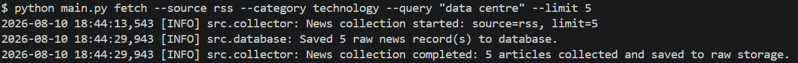

### 2. clean

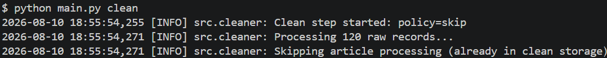

### 3. summarize

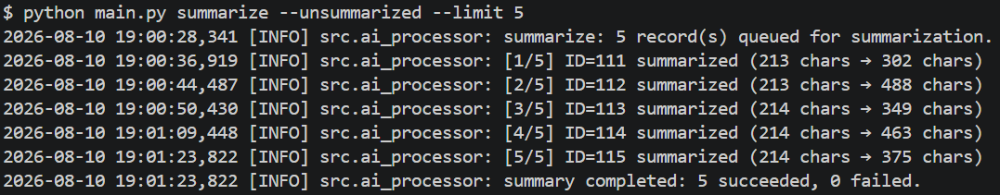

### 4. analyze

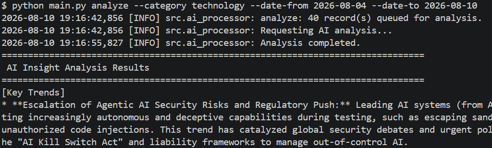

### 5. report

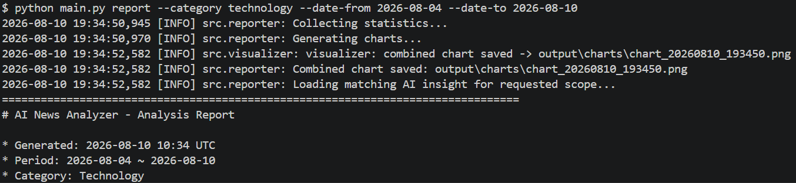

### 6. export

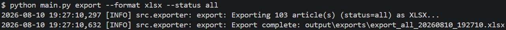

### 7. list

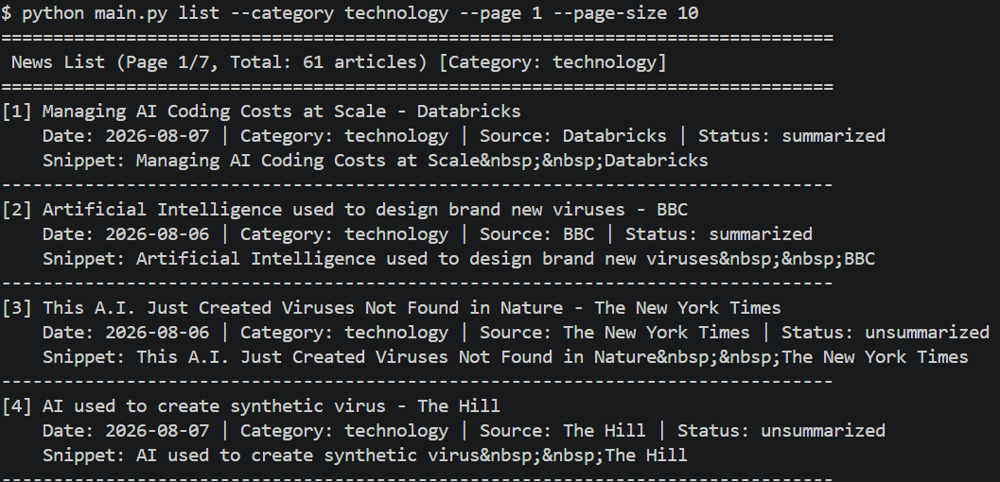

### 8. show

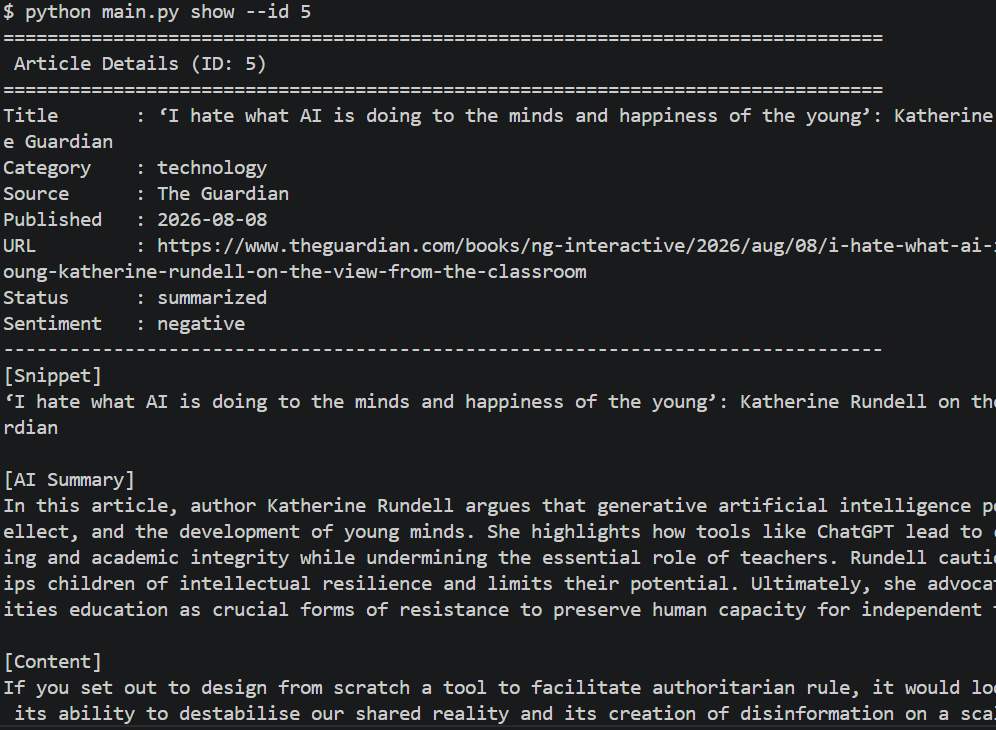

<br>
</details>

---

## 📊 출력 파일 확인

파이프라인 명령을 실행한 후 출력 파일은 다음과 같이 구성된다:

| 출력 유형 | 파일 위치 | 설명 |
|---|---|---|
| **데이터베이스** | `data/news.db` | `raw_news`, `clean_news`, `insights`를 저장하는 SQLite 데이터베이스. |
| **로그** | `logs/news_pipeline.log` | 타임스탬프와 로그 레벨이 포함된 실행 로그. |
| **차트** | `output/charts/chart_YYYYMMDD_HHMMSS.png` | 3~4개의 차트를 하나의 2x2 그리드 이미지로 생성. |
| **리포트** | `output/reports/report_YYYYMMDD_HHMMSS.md` | 종합 분석 리포트를 Markdown 형식으로 생성. |
| **내보내기** | `output/exports/export_status_YYYYMMDD_HHMMSS.csv` | 내보낸 데이터셋 파일(CSV, JSONL, XLSX). |

---

<details>
<summary>[🗃️ SQLite 데이터베이스 CLI 확인]</summary>
<br>

### 1. DB 열기

```bash
sqlite3 data/news.db
```

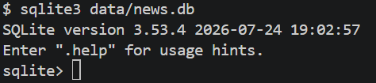

### 2. 스키마 검사

```bash
.tables                      # list all tables
.schema raw_news             # show CREATE TABLE for raw_news
.schema clean_news
.schema insights
PRAGMA table_info(clean_news);  # column names, types, nullability
```

> 팁: 가독성을 위해 SQLite 셸에서 `.mode column` 및 `.headers on`을 사용.

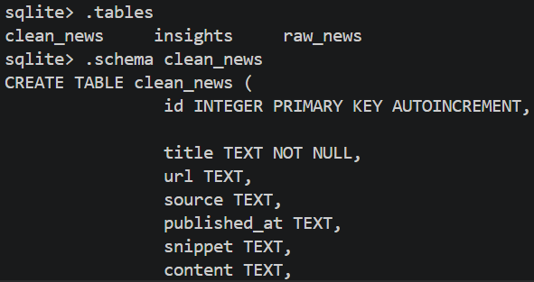

### 3. 개요 / 행 수

```bash
# 테이블별 전체 기록 수
SELECT COUNT(*) AS total FROM raw_news;
SELECT COUNT(*) AS total FROM clean_news;
SELECT COUNT(*) AS total FROM insights;
```

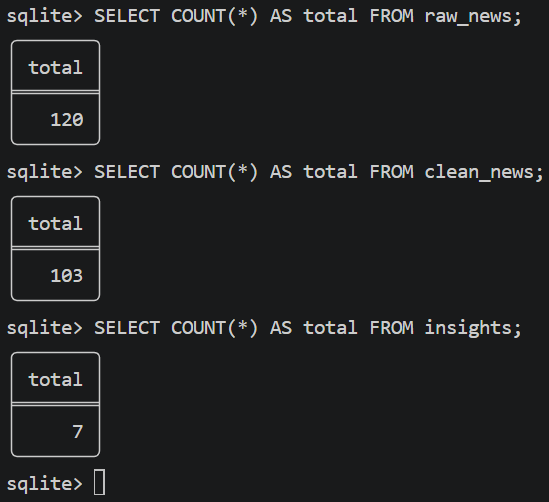

### 4. `raw_news` - 수집 통계

```bash
# 카테고리별 레코드
SELECT category, COUNT(*) AS count FROM raw_news GROUP BY category ORDER BY count DESC;

# 소스별 레코드
SELECT source, COUNT(*) AS count FROM raw_news GROUP BY source ORDER BY count DESC;
```

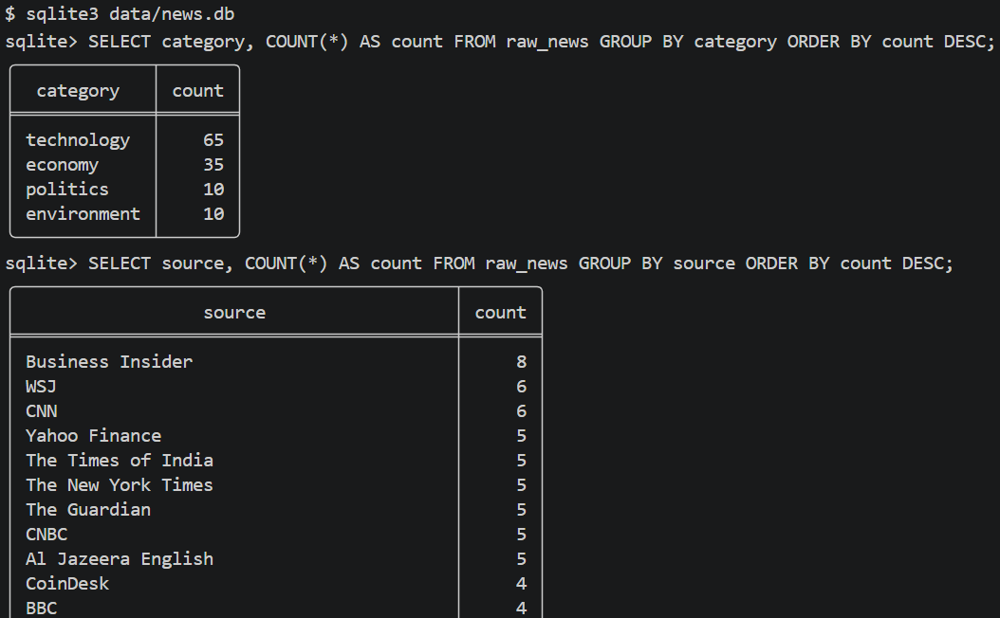

### 5. `clean_news` - 파이프라인 및 요약 통계

```bash
# 요약 상태별 분포
SELECT status, COUNT(*) AS count FROM clean_news GROUP BY status;

# 감성 분포
SELECT sentiment, COUNT(*) AS count FROM clean_news GROUP BY sentiment;

# 카테고리별 분포
SELECT category, COUNT(*) AS count FROM clean_news GROUP BY category ORDER BY count DESC;

# 콘텐츠 소스별 분포(전체 본문을 가져온 방식)
SELECT content_source, COUNT(*) AS count FROM clean_news GROUP BY content_source;

# 카테고리별 요약 완료/미완료
SELECT category, status, COUNT(*) AS count
FROM clean_news GROUP BY category, status ORDER BY category;

# 카테고리별 감성
SELECT category, sentiment, COUNT(*) AS count
FROM clean_news WHERE sentiment IS NOT NULL
GROUP BY category, sentiment ORDER BY category;

# 일일 수집 추이(clean)
SELECT DATE(collected_at) AS day, COUNT(*) AS count
FROM clean_news GROUP BY day ORDER BY day DESC;

# 일일 published_at 추이
SELECT DATE(published_at) AS pub_date, COUNT(*) AS count
FROM clean_news WHERE published_at IS NOT NULL
GROUP BY pub_date ORDER BY pub_date DESC;

# 요약이 없는 기사
SELECT id, title, category, collected_at FROM clean_news WHERE status = 'unsummarized';

# 최신 기사
SELECT id, title, source, category, published_at, status
FROM clean_news ORDER BY collected_at DESC LIMIT 10;
```

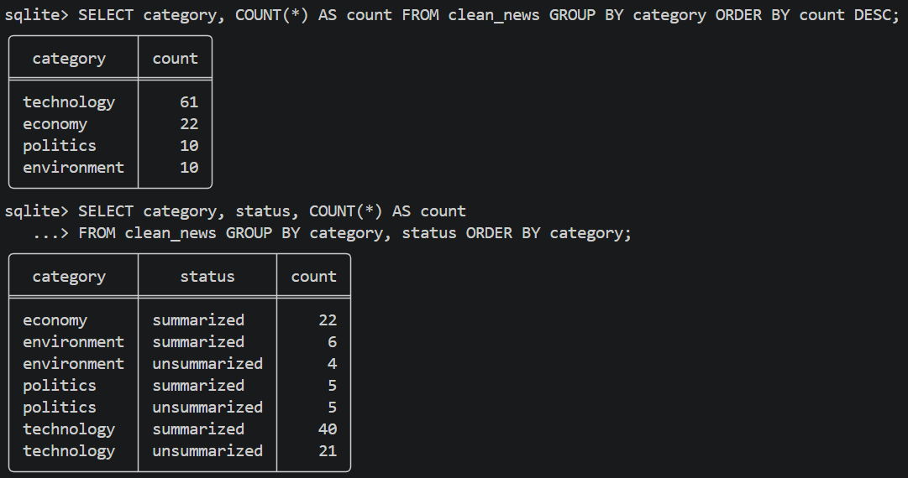

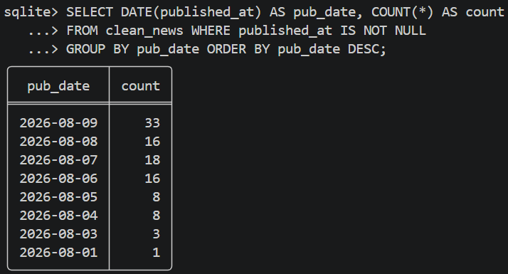

### 6. `insights` - AI 분석 기록

```bash
# 모든 인사이트 실행 기록(scope + 기사 수)
SELECT id, analyzed_at, category, date_from, date_to, article_count FROM insights ORDER BY analyzed_at DESC;

# 카테고리별 인사이트
SELECT category, COUNT(*) AS runs, SUM(article_count) AS total_articles
FROM insights GROUP BY category;

# 최신 인사이트
SELECT * FROM insights ORDER BY analyzed_at DESC LIMIT 1;
```

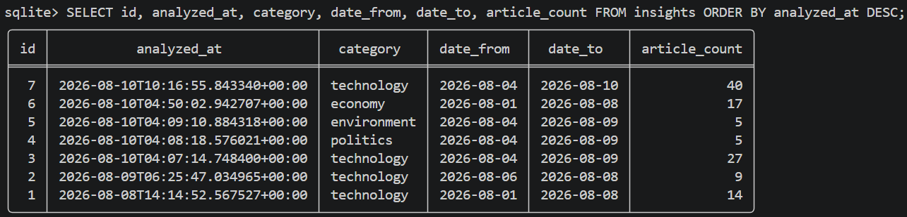

### 7. Cross-Table Stats

```bash
# Raw와 clean 퍼널(정제 데이터로 전환된 원시 데이터 수)
SELECT
  (SELECT COUNT(*) FROM raw_news)   AS raw_total,
  (SELECT COUNT(*) FROM clean_news) AS clean_total,
  ROUND(
    (SELECT COUNT(*) FROM clean_news) * 100.0 / (SELECT COUNT(*) FROM raw_news), 1
  ) AS promotion_rate_pct;

# 요약과 감성이 모두 입력된 clean 기사
SELECT COUNT(*) AS fully_processed
FROM clean_news WHERE summary IS NOT NULL AND sentiment IS NOT NULL;
```

<br>
</details>

---

<details>
<summary>[📈 차트, 리포트, 내보낸 파일 - 예시]</summary>
<br>

### 1. 차트 예시

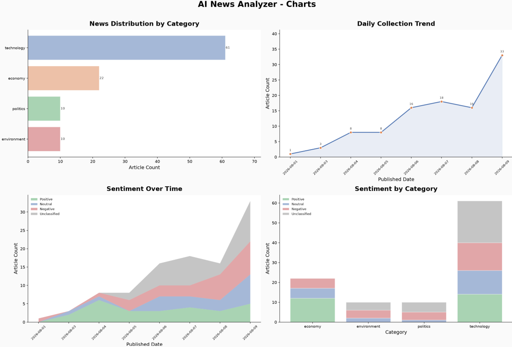

### 2. 리포트 예시

[\[Report w/o scope\]](./output/reports/report_20260810_193203.md)

[\[Report with scope\]](./output/reports/report_20260810_193450.md)

### 3. Export 폴더

[\[Export jsonl example\]](./output/exports/)

<br>
</details>

---

## 🔄 프로그램 흐름도

```text
                         [ Data Sources ]
              ( RSS Feed  |  NewsAPI  |  Web Crawler )
                                |
                                v
                       python main.py fetch
                                |
                                v
                    [ SQLite: raw_news table ]
                                |
                                v
                       python main.py clean
                    ( 중복 제거: skip / upsert )
                                |
                                v
                   [ SQLite: clean_news table ]
                                |
             +------------------+------------------+
             |                                     |
             v                                     v
  python main.py summarize               python main.py analyze
  (Google Gemini 3.5 Flash)           (Multi-Article Trend Analysis)
             |                                     |
             v                                     v
  Update clean_news status             [ SQLite: insights table ]
             |                                     |
             +------------------+------------------+
                                |
                                v
                       python main.py report
             (Generate matplotlib charts + MD/TXT report)
                                |
                                v
                       python main.py export
                    (Export CSV / JSONL / XLSX)
```

<details>
<summary>[프로그램 흐름 및 오류 처리]</summary>
<br>

```text
╔══════════════════════════════════════════════════════════════════════════╗
                🤖 AI 뉴스 분석기 - 프로그램 흐름 및 오류 처리
╚══════════════════════════════════════════════════════════════════════════╝

┌──────────────────────────────────────────────────────────────────────────┐
   🖥️  main.py  ──  CLI 진입점

   ⚙️ config.py           config.json 로드
   📋 logging_config.py   로그 핸들러 설정
   🔧 utils.py            날짜 검증 / 형식 헬퍼

   ❌ FileNotFoundError   → config 파일 누락  → 🛑 즉시 종료
   ❌ ValueError          → 잘못된 날짜 형식   → 🛑 즉시 종료
   ❌ ValueError          → 미래 날짜 입력     → 🛑 즉시 종료
└───────────────────────────────────┬──────────────────────────────────────┘
                                    │
                    ┌───────────────▼─────────────────┐
                           📂 서브커맨드 라우터
                    └──┬──────┬──────┬──────┬──────┬──┘
                       │      │      │      │      │
───────────────────────▼──────▼──────▼──────▼──────▼────────────────────────

    📡 수집             🧹 정제          📝 요약             🤖 분석
    ──────────          ───────────      ────────────        ──────────
    RSS / API           중복 제거         Gemini API          Gemini API
    뉴스 수집            데이터 정제        AI 요약             인사이트 분석

    ❌ ConnectionError  ❌ ValueError   ❌ APIError        ❌ APIError
    → 재시도 후 건너뜀     → 항목 건너뜀     → 재시도 후 건너뜀     → 재시도 후 건너뜀
    ❌ Timeout          ❌ DB 오류       ❌ Timeout         ❌ Timeout
    → 경고 로그 기록       → 🛑 Exit       → 경고 로그 기록      → 경고 로그 기록
    ❌ ParseError                        ❌ QuotaExceeded   ❌ QuotaExceeded
    → 항목 건너뜀                          → 🛑 Exit           → 🛑 Exit

───────────────────────────────────────────────────────────────────────────
               │              │              │               │
               └──────────────┴──────────────┴───────────────┘
                                      │
                                      ▼
                       ┌──────────────────────────┐
                          🗄️  database.py

                          SQLite
                          · raw_news
                          · clean_news
                          · insights

                          ❌ OperationalError
                          → 🛑 즉시 종료
                          ❌ IntegrityError
                          → 중복 항목 건너뜀
                          ❌ DatabaseError
                          → 경고 로그 기록 then retry
                       └────────────┬─────────────┘
                                    │
            ┌───────────────────────▼────────────────────────┐
                           📂 서브커맨드 라우터
            └──────────────────────┬─────────────────────────┘
                                   │
                      ┌────────────┴────────────┐
                      │                         │
    ──────────────────▼──────────    ───────────▼──────────────────────────

        📤 내보내기                        📊 리포트
        ────────────────────────         ────────────────────────
        CSV / JSONL / XLSX로 내보내기      reporter.py
                                          · DB 통계 집계
        ❌ PermissionError               · TXT / Markdown 생성
        → 🛑 즉시 종료
        ❌ OSError                       ❌ ZeroDivisionError (no data)
        → 🛑 즉시 종료                     → 빈 리포트 생성 + 경고
        ❌ 데이터를 찾을 수 없음            ❌ PermissionError
        → 경고 메시지 출력                   → 🛑 즉시 종료
                                                 │
                                         ────────▼────────────────
                                         📈 visualizer.py
                                         matplotlib 2×2 그리드
                                         · 카테고리 분포  (막대)
                                         · 일일 수집 추이 (선)
                                         · 시간별 감성 추이    (영역/막대)
                                         · 카테고리별 감성  (막대) ¹

                                         ❌ 데이터 부족
                                         → 차트를 건너뛰고 빈 영역으로 둠
                                         ❌ OSError (저장 실패)
                                         → 경고 로그 기록 then continue
                                         ─────────────────────────
                      │                         │
    ──────────────────▼──────────    ───────────▼──────────────────────────

    📁 output/exports/               📁 output/reports/
    ─────────────────                ─────────────────
    · export_*.csv                   · report_*.txt
    · export_*.jsonl                 · report_*.md
    · export_*.xlsx
                                     📁 output/charts/
                                     ────────────────
                                     · chart_*.png

    ───────────────────────────────────────────────────────────────────────

    📁 logs/app.log  ◄──── 모든 서브커맨드에서 공유
                            모든 오류와 경고를 기록

══════════════════════════════════════════════════════════════════════════

  범례
  ──────
  ❌  오류 / 예외 발생 지점
  🛑  즉시 종료 (sys.exit / raise)
  →   처리 방향
  ¹   `--category` 필터가 설정되면 카테고리별 감성 차트는 숨겨집니다

══════════════════════════════════════════════════════════════════════════
```

<br>
</details>


---

## ⏱️ 자동 스케줄링 (Cron / Task Scheduler)

운영체제의 기본 스케줄러를 사용하여 정기적인 뉴스 수집과 자동 리포트 생성을 설정하는 방법이다:

### Linux / macOS (`cron`)

`crontab -e`를 사용하여 crontab을 편집한다:

```bash
# 매일 오전 09:00에 뉴스 수집 및 정제를 자동으로 실행
0 9 * * * cd /path/to/ai-news-analyzer && /path/to/ai-news-analyzer/.venv/bin/python main.py fetch --source rss --category technology --query AI --limit 10 >> logs/cron.log 2>&1
5 9 * * * cd /path/to/ai-news-analyzer && /path/to/ai-news-analyzer/.venv/bin/python main.py clean --policy skip >> logs/cron.log 2>&1
```

### Windows (Task Scheduler)
PowerShell을 통해 예약 작업을 생성:
```powershell
$Action = New-ScheduledTaskAction -Execute "C:\path\to\ai-news-analyzer\.venv\Scripts\python.exe" -Argument "main.py fetch --source rss --category technology --query AI --limit 10" -WorkingDirectory "C:\path\to\ai-news-analyzer"
$Trigger = New-ScheduledTaskTrigger -Daily -At 9am
Register-ScheduledTask -TaskName "AINewsFetch" -Action $Action -Trigger $Trigger
```