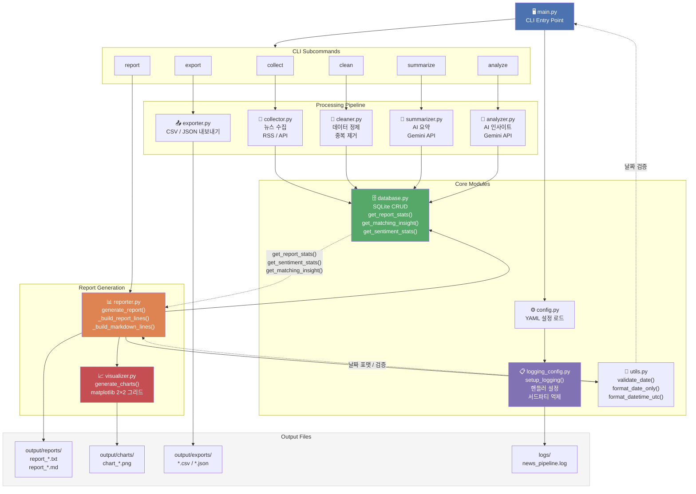

```mermaid
flowchart TD
    CLI["🖥️ main.py\nCLI Entry Point"]

    subgraph CMD["CLI Subcommands"]
        direction LR
        C1["collect"]
        C2["clean"]
        C3["summarize"]
        C4["analyze"]
        C5["export"]
        C6["report"]
    end

    subgraph CORE["Core Modules"]
        direction TB
        DB["🗄️ database.py\nSQLite CRUD\nget_report_stats()\nget_matching_insight()\nget_sentiment_stats()"]
        CFG["⚙️ config.py\nYAML 설정 로드"]
        LOG["📋 logging_config.py\nsetup_logging()\n핸들러 설정\n서드파티 억제"]
        UTIL["🔧 utils.py\nvalidate_date()\nformat_date_only()\nformat_datetime_utc()"]
    end

    subgraph PIPELINE["Processing Pipeline"]
        direction TB
        COL["📡 collector.py\n뉴스 수집\nRSS / API"]
        CLN["🧹 cleaner.py\n데이터 정제\n중복 제거"]
        SUM["📝 summarizer.py\nAI 요약\nGemini API"]
        ANL["🤖 analyzer.py\nAI 인사이트\nGemini API"]
        EXP["📤 exporter.py\nCSV / JSON 내보내기"]
    end

    subgraph REPORT["Report Generation"]
        direction TB
        REP["📊 reporter.py\ngenerate_report()\n_build_report_lines()\n_build_markdown_lines()"]
        VIZ["📈 visualizer.py\ngenerate_charts()\nmatplotlib 2×2 그리드"]
    end

    subgraph OUTPUT["Output Files"]
        direction LR
        O1["output/reports/\nreport_*.txt\nreport_*.md"]
        O2["output/charts/\nchart_*.png"]
        O3["output/exports/\n*.csv / *.json"]
        O4["logs/\nnews_pipeline.log"]
    end

    CLI --> CMD
    CLI --> CFG
    CFG --> LOG
    LOG --> O4

    C1 --> COL --> DB
    C2 --> CLN --> DB
    C3 --> SUM --> DB
    C4 --> ANL --> DB
    C5 --> EXP --> O3

    C6 --> REP
    REP --> DB
    REP --> VIZ
    REP --> UTIL
    VIZ --> O2
    REP --> O1

    DB -.->|"get_report_stats()\nget_sentiment_stats()\nget_matching_insight()"| REP
    UTIL -.->|"날짜 포맷 / 검증"| REP
    UTIL -.->|"날짜 검증"| CLI

    style CLI fill:#4C72B0,color:#fff
    style DB fill:#55A868,color:#fff
    style REP fill:#DD8452,color:#fff
    style VIZ fill:#C44E52,color:#fff
    style LOG fill:#8172B3,color:#fff
    style OUTPUT fill:#f5f5f5,stroke:#ccc
```