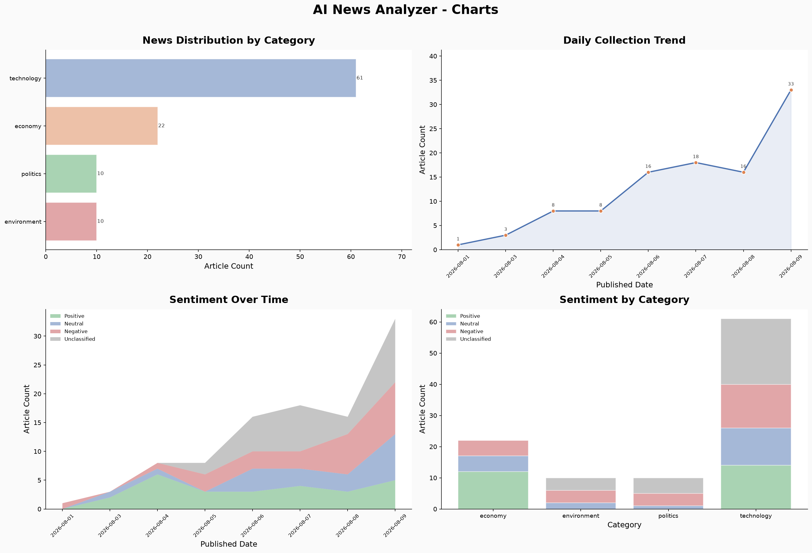

# AI News Analyzer - Analysis Report

* Generated: 2026-08-10 10:32 UTC
* Period: All available data
* Category: All categories

---

## Overview

| Metric | Count |
|--------|-------|
| Raw articles collected | 120 |
| Clean articles stored  | 103 |
| Articles summarized    | 73 |

## Quality Metrics

| Metric | Value |
|--------|-------|
| Summarization rate | 73 / 103 (70.9%) |
| Content coverage   | 103 / 103 (100.0%) |

## Top 5 Sources

| Rank | Source | Articles |
|------|--------|----------|
| 1 | WSJ | 6 |
| 2 | CNN | 6 |
| 3 | Yahoo Finance | 5 |
| 4 | The Guardian | 5 |
| 5 | Business Insider | 5 |

## Category Distribution

| Category | Articles |
|----------|----------|
| technology | 61 |
| economy | 22 |
| politics | 10 |
| environment | 10 |

## Sentiment Distribution

| Sentiment | Articles |
|-----------|----------|
| (none) | 30 |
| negative | 27 |
| positive | 26 |
| neutral | 20 |

## Charts

## AI Insight Analysis

> No AI insight found. Run `python main.py analyze` first.
